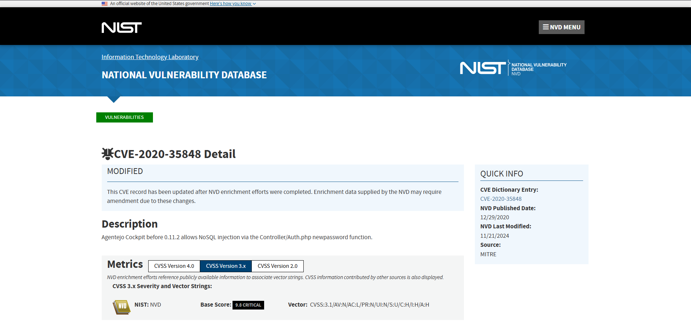
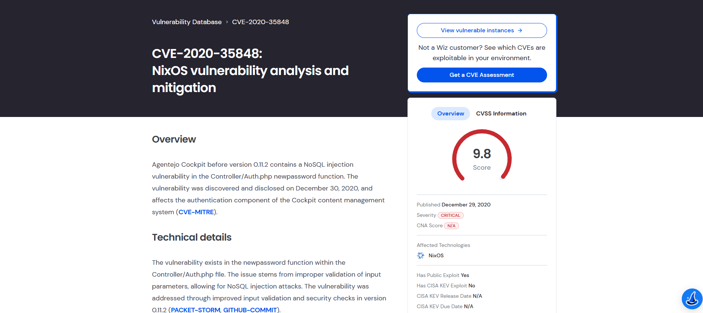
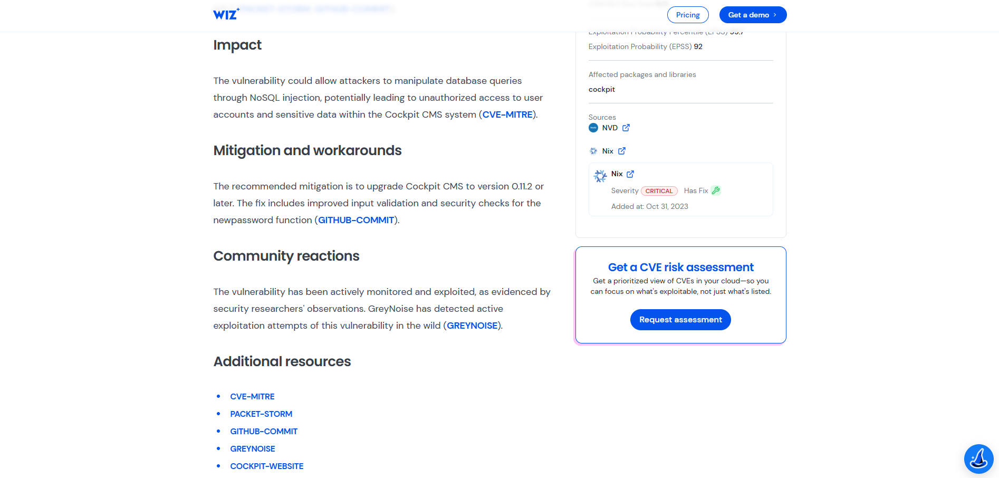
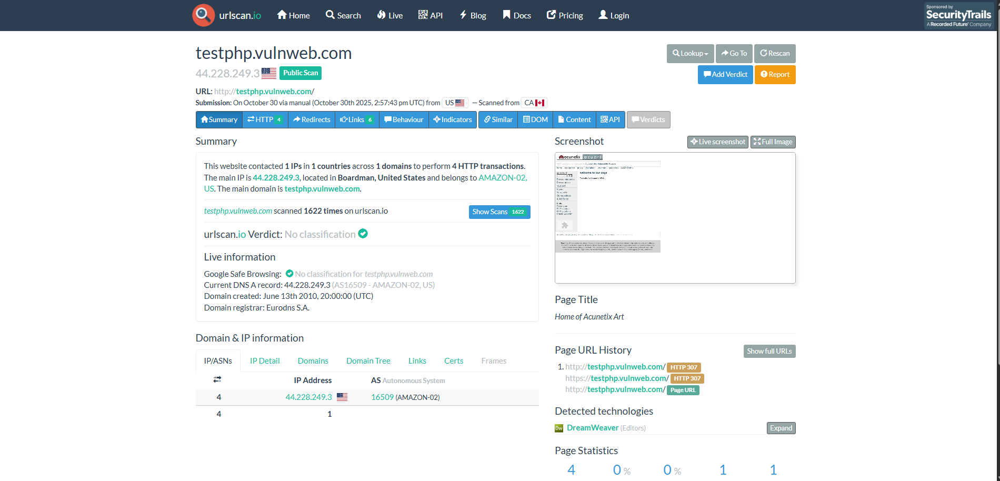

# Critical Vulnerability CVE-2020-35848
Simulated the SOC Triage/Analyze workflow by assessing a critical CVE (9.8). Tasks included rapid CVSS risk assessment, confirming active exploitation via threat intelligence, executing an open-source scanner POC, and compiling findings into an Executive Triage Report for immediate mitigation.

## Skills Learned

- Vulnerability Triage & Prioritization: Rapidly assessing a high-severity CVE (9.8 Critical) for immediate operational risk based on CVSS scoring and confirmed active exploitation.
- Threat Intelligence Application: Leveraging the National Vulnerability Database (NVD) to determine technical impact and external security advisories to confirm public Proof of Concept (POC) status.
- Mitigation Strategy Formulation: Identifying and documenting the precise, actionable steps (e.g., patch version, workarounds) required for immediate risk reduction.
- Tool Integration (POC): Utilizing a free, open-source-backed online scanner (URLScan.io) for remote reconnaissance to demonstrate a target's potential attack surface.
- Executive Communication: Structuring technical findings into a concise, high-impact report suitable for non-technical leadership review.

### Tools Used

- National Vulnerability Database (NVD) for authoritative CVSS scoring and technical details.
- Open-Source Intelligence (OSINT) via Google search (for vendor advisories and exploit status).
- URL Analysis Service (URLScan.io) for remote, non-intrusive Proof of Concept scanning.

## Steps

Example below.

*Ref 1: NVD Analysis*

- This screenshot confirms we focused on CVE-2020-35848, an authentication bypass vulnerability.
-  It immediately establishes the severity for executive reporting, showing a Critical CVSS Base Score of 9.8.
-  The technical details summarize the flaw as a NoSQL injection in the newpassword function of the Agentcjo Cockpit CMS.
-  The high-risk nature is further confirmed by the note that the vulnerability "Has Public Exploit: Yes," which demands immediate, high-priority mitigation.

*Ref 3: Find Patch/Mitigation*

- Mitigation Strategy:This step provided the immediate action plan for the P1 incident, confirming the required mitigation is to upgrade Cockpit CMS to version 0.11.2 or later.
- Active Threat Confirmation : The review of threat intelligence noted that GreyNoise has confirmed active exploitation attempts in the wild. This finding was critical for elevating the incident to an urgent priority for the executive report.

*Ref 4: Run Remote Scan*

- To demonstrate the initial reconnaissance phase of a triage incident, an online scanner was run against a benign test target (http://testphp.vulnweb.com).
-  This action simulated the use of an open-source tool to rapidly gather technical intelligence, like the main IP and hosting details, which is a necessary step before confirming if a critical CVE (like the one in Cockpit CMS) is present on live assets.
-  These results indicate the sender was unauthorized  to use the domain confirming a spoofing attempt

 # Mitigation and Containment
 - P1: Immediate Patching: The core vulnerability, CVE-2020-35848 (CVSS 9.8), must be eliminated by upgrading the Cockpit CMS to version 0.11.2 or later.
 - Asset Isolation: All internal servers running the vulnerable Cockpit CMS must be isolated from public network access immediately until the patch is successfully deployed and verified.
 - Vulnerability Remediation: The patch focuses on improving input validation in the affected newpassword function, eliminating the NoSQL injection flaw.

# Final Reflections

The project successfully simulated a high-stakes SOC triage event, emphasizing the critical link between threat intelligence and decisive action. Key skills demonstrated include the ability to prioritize an incident based on a Critical CVSS 9.8 score and confirmation of active exploitation. We also validated the practical use of open-source tools: using URLScan.io for remote asset reconnaissance to map a target's IP, and utilizing AbuseIPDB to immediately justify a containment block on a malicious IP with 30 abuse reports. This experience reinforced the principle that effective security requires rapid analysis, data-driven prioritization, and swift implementation of both network containment and vendor patches, culminating in an actionable executive report.
